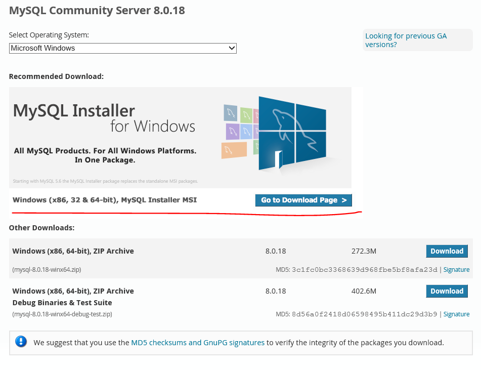
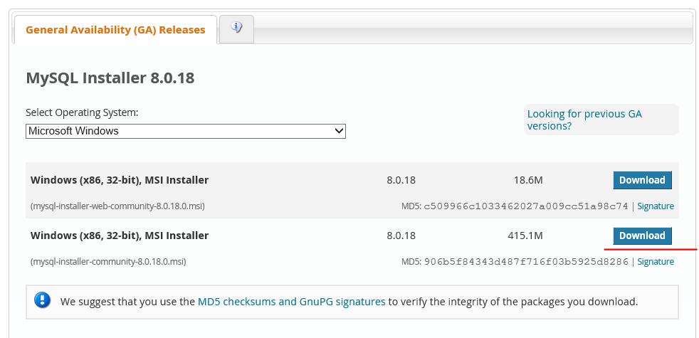
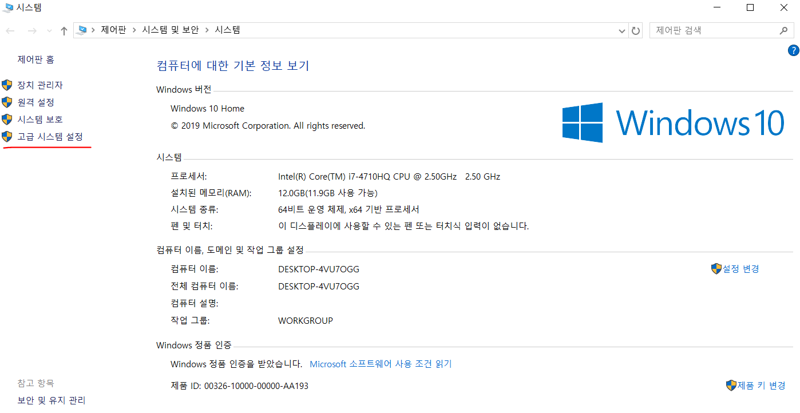
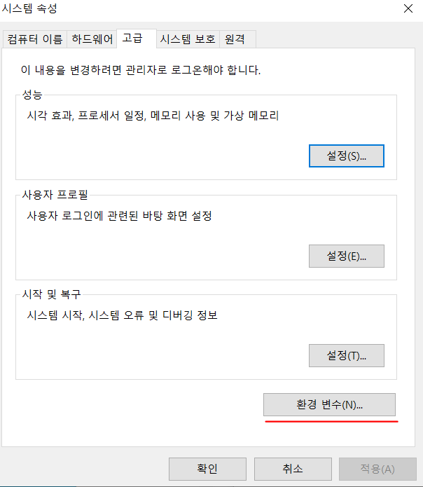
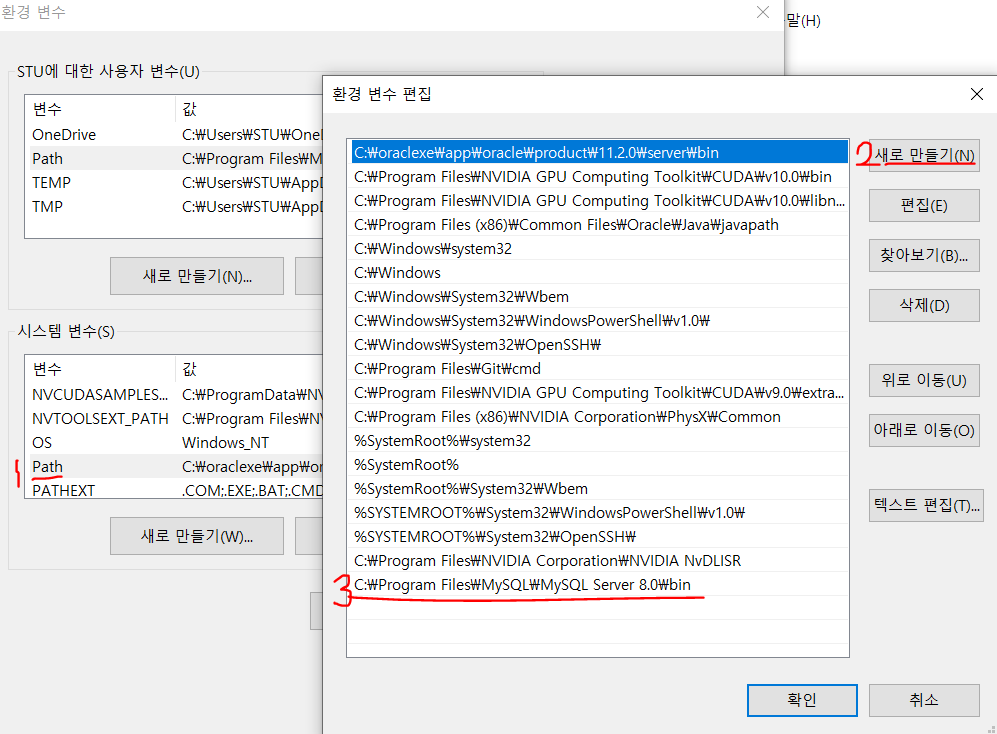
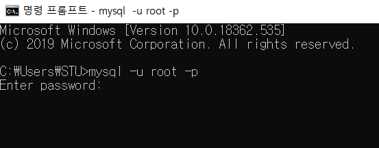
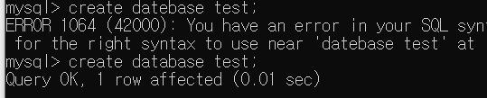
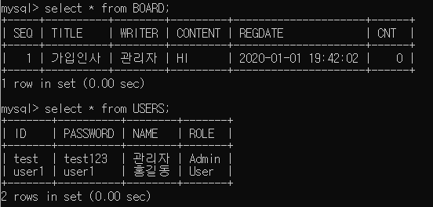

# 01_MySQL_INTRO

## 1. 설치하기

- [MySQL 다운로드](https://dev.mysql.com/downloads/mysql/)을  클릭했다면,
- 
- 

- 다운로드 후 설치가 시작되면 모두 excute, next 하도록 한다.
  - root 비밀번호는 까먹지 말고, 다른데 적어둬도 좋다.

## 2. 환경 변수 설정

- 설치가 끝났지만 CMD로는 MySQL을 시작할 수 없다.
- 그렇기 때문에 환경변수를 설정해 주자.

- 먼저 MySQL을 설치한 폴더를 찾아주자, 특별히 바꾼 기억이 없다면 다음과 같다.

  - C:\Program Files\MySQL\MySQL Server 8.0\bin

- 환경 변수 설정을 위해서 **내 컴퓨터를 우클릭** 하고 **속성**에 들어가면, 다음과 같은 화면이 열린다.

  

- 들어간 후

  

- 순서대로 진행한다.

  

- 이렇게 되었다면 이제 CMD에서 MySQL을 실행할 수 있다.

  

  ```bash
  $ mysql -u 계정명 -p	# root 계정으로 접속하기
  ```

- password를 입력하면 mysql이 시작된다 .

  ```mysql
  $ select version()
  ```

  - 을 입력하게 되면 자신이 설치한 MySQL 버전을 확인 할 수 있다.

## 3. 시작하기

- 먼저 데이터베이스를 생성해 주어야 한다.

  ```mysql
  $ create database DB이름;
  ```

  

- 이제 데이터베이스를 사용하자.

  ```mysql
  $ use DB이름;
  ```

  

- UERS 테이블 생성

  - MySQL은 VARCHAR2가 없다 조심하도록 하자.

  ```mysql
  $ CREATE TABLE USERS(
      ID VARCHAR(8) PRIMARY KEY,
      PASSWORD VARCHAR(8), 
      NAME VARCHAR(20), 
      ROLE VARCHAR(5)
  );
  ```

- USER 데이터 삽입

  ```mysql
  $ INSERT INTO USERS VALUES('test', 'test123', '관리자', 'Admin');
  $ INSERT INTO USERS VALUES('user1', 'user1', '홍길동', 'User');
  ```

- BOARD 테이블 생성

  ```mysql
  $ CREATE TABLE BOARD(
  	SEQ INT(5) PRIMARY KEY,
      TITLE VARCHAR(200),
      WRITER VARCHAR(20),
      CONTENT VARCHAR(2000),
      REGDATE DATETIME DEFAULT NOW(),
      CNT INT(5) DEFAULT 0
  );
  ```

- BOARD 데이터 삽입

  ```mysql
  $ INSERT INTO BOARD(SEQ, TITLE, WRITER, CONTENT) VALUES(1, '가입인사', '관리자', 'HI');
  ```

- 데이터 및 테이블 확인

  ```mysql
  $ select * from BOARD;
  $ select * from USERS;
  ```

  

- 이제 준비는 끝났다.