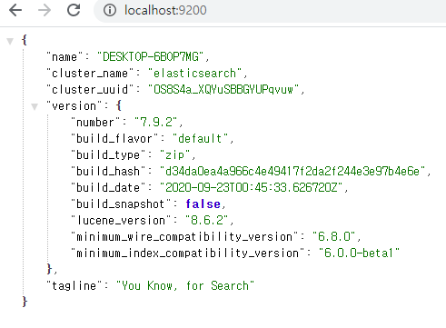
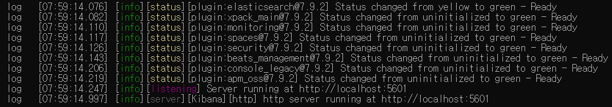
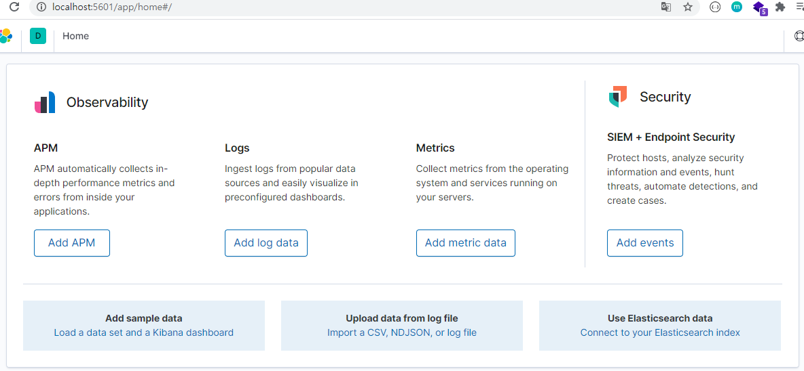

# 1. ELK 설치 (Windows 10)

> **ELK는 모두 같은 버전을 설치**해야한다. 그래야 에러가 발생하지 않음

## 1.1 Elasticsearch 설치

- [https://www.elastic.co/kr/downloads/elasticsearch](https://www.elastic.co/kr/downloads/elasticsearch)에서 WINDOWS 버전 ZIP 파일 다운로드

- 압축파일 해제 - bin - elasticsearch.bat 실행

- localhost:9200 접속 후 확인

  

## 1.2 Logstash 설치

- [https://www.elastic.co/kr/downloads/logstash](https://www.elastic.co/kr/downloads/logstash)에서 ZIP 파일 다운로드

- **Elasticsearch를 실행하고**  Logstash가 압축 해제된 경로를 cmd로 열고 아래 명령어 입력

  ```bash
  $ .\bin\logstash.bat -f .\config\logstash-sample.conf
  ```

## 1.3 Kibana 설치

- [https://www.elastic.co/kr/downloads/kibana](https://www.elastic.co/kr/downloads/kibana) 에서 WINDOWS 버전 다운로드

- 압축 해제 - bin - kibana.bat 실행

  - **압축 해제에 시간이 오래 걸리므로 버전에 주의**
  - Elasticsearch가 실행되고 있어야 함

- 기다리면 다음과 같은 커맨드가 보여짐

  

- localhost:5601로 접속 후 확인

  

# 2. ELK 설치 (LINUX)

## 2.1 Elasticsearch 설치

- jdk 설치 확인 없으면 설치

  ```bash
  $ javac -version
  
  $ sudo apt-get install openjdk-1.8-jdk
  ```

- Elasticsearch GPG 공개키 import

  ```bash
  $ wget -qO - https://artifacts.elastic.co/GPG-KEY-elasticsearch | sudo apt-key add -
  
  $ OK # OK가 나오면 정상적으로 import
  ```

- Elasticsearch repository 등록

  ```bash
  $ sudo sh -c 'echo "deb https://artifacts.elastic.co/packages/7.x/apt stable main" > /etc/apt/sources.list.d/elastic-7.x.list'
  ```

- Elasticsearch 설치

  ```bash
  $ sudo apt-get update && sudo apt-get install elasticsearch
  ```

- 실행

  ```bash
  $ systemctl enable elasticsearch.service
  
  $ systemctl start elasticsearch.service
  ```

  