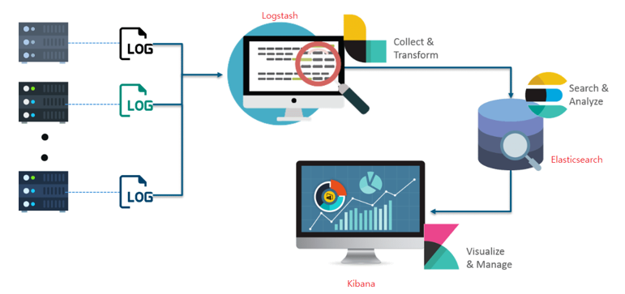

# Elasticsearh ?

- Elasticsearch는 Apache Lucene 기반의 Java 오픈소스 분산 검색 엔진
  - **Lucene flush**
    - 문서 색인 요청이 들어오면 루씬은 문서를 분석해 역색인 생성
    - 최초 생성 자체는 메모리 버퍼에 들어가고, 문서 색인, 업데이트, 삭제 등의 작업이 수행되면 루씬은 이러한 변경들을 디스크에 flush 함
    - 색인한 정보를 파일로 저장하기에 검색을 하려면 먼저 파일을 열어야 함
      - 루씬은 파일을 연 시점에 색인이 완료된 문서만 검색 가능
      - 색인에 변경사항이 발생했고, 내용을 검색 결과에 반영하고 싶다면 파일을 새로 열어야 함
      - 검색 대상이 되기까지의 과정을 **refresh**라고 하는데, 이 과정은 비용이 있는 작업이기에 색인이 변경될 때마다 수행하지 않고, 적절한 주기마다 실행 함
        - 그러나, refresh API를 호출하면 필요에 따라 명시적으로 refresh 수행 가능
  - **Lucene commit**
    - Lucene flush는 시스템 페이지 캐시에 데이터를 넘겨주는 것까지만 보장할 뿐 디스크에 파일이 실제로 안전하게 기록되는 것까지 보장하지는 않음
    - 이에 따라, 루씬은 fsync 시스템 콜을 통해 주기적으로 커널 시스템의 페이지 캐시의 내용과 실제로 디스크에 기록된 내용의 싱크를 맞추는 작업을 수행, 이를 **Lucene commit** 이라 함
    - ES flush 작업은 내부적으로 Lucene commit을 거치지만, 다른 개념이기에 혼동하면 안 됨
      - ES flush는 ES refresh 보다도 훨씬 비용이 많이 들기에 refresh와 마찬가지로 적절한 주기로 수행
  - **세그먼트**
    - 앞의 작업을 거쳐 디스크에 기록된 파일들이 모이면 세그먼트라는 단위가 됨
    - 이 세그먼트가 루씬의 검색 대상
      - 루씬은 검색 요청을 받으면 다수의 작은 세그먼트 조각들이 각 검색 결과 조각을 만들어 내고 통합해서 하나의 결과로 응답하도록 설계됨
      - 이를 **세그먼트 단위 검색(Per-Segment Search)**라고 함
    - 세그먼트 자체는 불변(immutable)인 데이터로 구성
    - 새 문서가 들어오면 새 새그먼트가 생성되고, 기존 문서가 삭제되면 플래그만 표시해 둠, 기존 문서가 ㅓㅂ데이트가 발생한 경우 삭제 플래그를 표시하고 새 세그먼트 생성
    - **세그먼트 병합**
      - 불변인 세그먼트 개수를 무작정 늘려갈 수 없기에 루씬은 중간중간 적당히 세그먼트의 병합을 수행
      - 병합이 수행될 때 삭제 플래그가 표시된 데이터를 실제로 삭제하는 작업도 수행
      - 병합은 비싼 작업이지만, 병합을 하고 나면 검색 성능 향상 기대 가능
      - forcemerge API를 통해 명시적으로도 수행 가능
      - 다만, 명시적인 세그먼트 병합은 더 이상 추가 데이터 색인이 없을 것이 보장될 떄 수행해야 함
  - **루씬 인덱스와 ES 인덱스**
    - 여러 세그먼트가 모이면 하나의 루씬 인덱스가 됨
    - 루씬은 이 인덱스 내에서만 검색 가능
    - ES 샤드는 이 루씬 인덱스 하나를 래핑(wrapping)한 단위
    - 또한, ES 샤드 여러 개가 모이면 ES 인덱스가 됨
      - 세그먼트 > 루씬 인덱스 > ES 샤드 > ES 인덱스
  - **translog**
    - 변경사항이 있을 때마다 루씬 commit을 수행하기에는 commit은 비용이 많이 들지만, 변경사항을 모아서 commit한다면 장애가 발생했을 시 미쳐 commit이 되지 않았을 때 데이터가 유실될 우려 존재
    - 이 문제를 해결하기 위해 ES 샤드는 모든 작업마다 translog라는 이름의 작업 로그를 남김
    - 색인, 삭제 작업이 루씬 인덱스에 수행된 직후 기록되고, 이 기록까지 끝난 이후에야 작업 요청이 성공으로 승인
    - translog에는 디스크에 fsync된 데이터만 보존
- 방대한 양의 데이터를 신속하게, 거의 실시간(NRT, Near Real Time)으로 저장, 검색, 분석 가능

- Elasticsearch는 검색을 위해 단독으로 사용되기도 하며, **ELK( Elasticsearch / Logstash / Kibana ) Stack**으로 사용 가능

  - Logstash : 다양한 소스(DB, CSV 파일 등)의 로그 또는 트랜젝션 데이터를 수집, 집계, 파싱하여 Elasticsearch로 전달
  - Elasticsearch : Logstash로부터 받은 데이터를 검색 및 집계를 하여 필요한 관심 있는 정보를 획득
    - **검색 엔진**
      - 다른 RDBMS나 경쟁 NoSQL에 비해 매우 강력한 검색 기능 제공
      - 단순 텍스트 매칭 검색이 아닌 전문 검색(full-text) 검색 가능하며 다양한 종류의 검색 쿼리 지원
      - 검색 엔진이기 때문에 역색인을 사용하여 검색 속도가 매우 빠름
        - 역색인(Inverted Index)
          - 키워드를 통해 문서를 찾아내는 방식
          - 검색 성능이 매우 빠름
    - **분산 처리**
      - 엘라스틱서치는 분산 처리를 고려하여 설계
      - 데이터를 여러 노드에 분산 저장하며 검색이나 집계 작업 등을 수행할 때도 분산 처리 지원
    - **고가용성 제공**
      - 클러스터를 구성하고 있는 일부 노드에 장애가 발생해도 복제본 데이터를 이용해 중단 없이 서비스 지속 가능
      - 엑라스틱서치는 다시 복제본을 만들어 복제본의 개수를 유지하면서 노드 간 데이터의 균형을 자동으로 맞춤
    - **수평적 확장성**
      - 요청 수나 데이터의 양이 증가하여 더 많은 처리 능력이 욕되는 때가 생기는데 이를 대비 가능
      - 더 많은 처리 능력이 필요할 때에는 새로운 노드에 엘라스틱서치를 설치하여 클러스터에 참여시키는 것만으로도 확장 가능
      - 새 노드에 데이터를 복제하거나 옮기는 작업도 엘라스틱서치가 자동 수행
    - **JSON 기반의 REST API 제공**
      - JSON 형태의 문서를 저장, 색인 검색
      - 특별한 클라이언트의 사전 설치 없이도 환경에 구애받지 않고 HTTP를 통해 쉽게 이용 가능
    - **데이터 안정성**
    - **다양한 플러그인을 통한 기능 확장 지원**
    - **준실시간 검색**
      - 데이터를 색인하자마자 조회하는 것은 가능하지만, 데이터 색인 직후의 검색 요청은 성공하지 못할 가능성이 높음
      - 역색인을 구성하고 이 역색인으로부터 검색이 가능해지기까지 시간이 걸리기 때문
    - **트랜잭션이 지원되지 않음**
    - **사실상 조인을 지원하지 않음**
      - RDBMS와는 다르게 데이터를 비정규화해야 함
  - Kibana : Elasticsearch의 빠른 검색을 통해 데이터를 시각화 및 모니터링

  

## 0. 비교

| Elasticsearch | Relation DB |
| :-----------: | :---------: |
|     Index     |  Database   |
|   ~~Type~~    |  ~~Table~~  |
|   Document    |     Row     |
|     Field     |   Column    |
|    Mapping    |   Schema    |

- **Type(Mapping Type)**
  - 7.0.X 이전에는 하나의 index 내에서 독립적인 document를 저장할 수 있도록 제공했었음
  - ES에서는 table이 독립적으로 분리되지 않음
  - Mapping Type이 달라도, index가 동일하면, 검색시 (`_score`)에 영향을 줌 > document를 효율적으로 압축하는 루씬의 기능을 방해
## 1. 활용처

- 애플리케이션 검색
- 웹사이트 검색
- 엔터프라이즈 검색
- 로깅과 로그 분석
- 인프라 메트릭과 컨테이너 모니터링
- 애플리케이션 성능 모니터링
- 위치 기반 정보 데이터 분석 및 시각화
- 보안 분석
- 비즈니스 분석

## 2. 작동

- 로그, 시스템 메트릭, 웹 애플리케이션 등 다양한 소스로부터 원시 데이터
- 데이터 수집은 원시 데이터가 Elasticsearch에서 색인되기 전에 구문 분석, 정규화, 강화되는 프로세스
- Elasticsearch에서 일단 색인되면, 사용자는 이 데이터에 대해 복잡한 쿼리를 실행하고 집계를 사용해 데이터의 복잡한 요약을 검색 가능
- Kibana에서 사용자는 데이터를 강력하게 시각화하고, 대시보드를 공유하며, Elastic Stack을 관리 가능

## 3. 사용 이유

- Lucene을 기반으로 구축되기 때문에, 전문 텍스트(full-text) 검색에 뛰어남. Elasticsearch는 또한 거의 실시간 검색 가능
- 문서가 색인될 때부터 검색 가능해질 때까지의 대기 시간이 보통 1초로, Elasticsearch는 보안 분석, 인프라 모니터링 같은 시간이 중요한 사용 사례에 이상적
- Elasticsearch에 저장된 문서는 샤드라고 하는 여러 다른 컨테이너에 걸쳐 분산되며, 이 샤드는 복제되어 하드웨어 장애 시에 중복되는 데이터 사본을 제공
- Elasticsearch의 분산적인 특징은 수백 개(심지어 수천 개)의 서버까지 확장하고 페타바이트의 데이터를 처리 가능
- 속도, 확장성, 복원력뿐 아니라, Elasticsearch에는 데이터 롤업, 인덱스 수명 주기 관리 등과 같이 데이터를 훨씬 더 효율적으로 저장하고 검색할 수 있게 해주는 강력한 기본 기능이 다수 탑재
- Beats와 Logstash의 통합은 Elasticsearch로 색인하기 전에 데이터를 훨씬 더 쉽게 처리 가능
- Kibana는 Elasticsearch 데이터의 실시간 시각화를 제공하며, UI를 통해 애플리케이션 성능 모니터링(APM), 로그, 인프라 메트릭 데이터에 신속하게 접근 가능