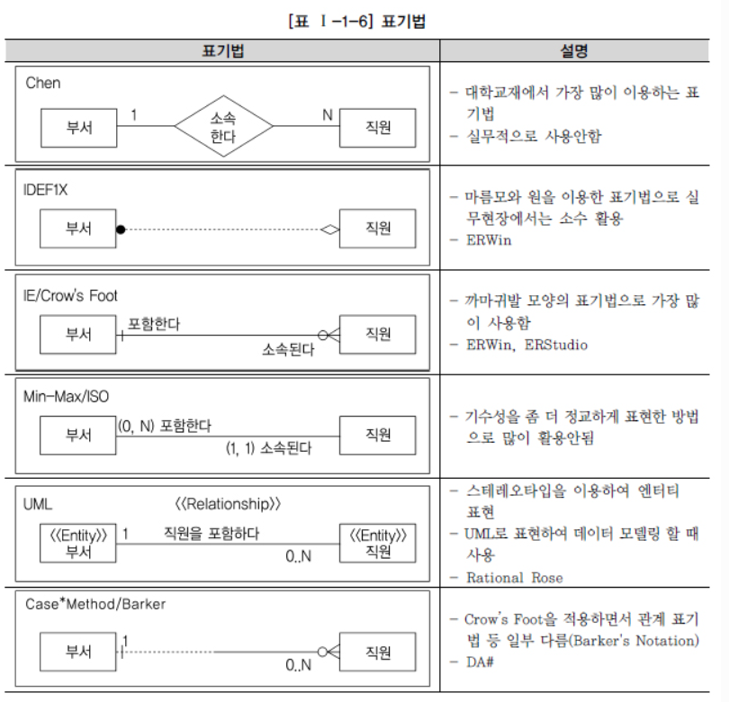

# SQLD_01(데이터 모델링의 이해)

### 1. 모델링의 이해

#### 1.1 모델링의 정의

- **복잡한 '현실세계'를 단순화시켜 표현하는 것**
- 모델이란 사물 또는 사건에 관한 **양상**이나 **관점**을 연관된 사람이나 그룹을 위하여 명확히 하는 것
- 모델이란 현실 세계의 추상화된 반영

#### 1.2 모델링 특징

- **추상화** : 현실세계의 현상이나 사물을 **일정한 양식인 표기법**에 의해 표현 ( = 모형화, 가설적)
- **단순화** : 복잡한 현실세계를 약속된 규약에 의해 제한된 표기법이나 언어로 표현
- **명확화** : 누구나 이해하기 쉽게 대상에 대한 애매모호함 제거하고 정확하게 현상을 기술

#### 1.3 모델링의 세 가지 관점

- **데이터 관점** : 업무가 어떤 데이터와 관련이 있는지, 데이터간 관계는 무엇인지 (What)
- **프로세스 관점** : 업무가 하는 일이 무엇인지, 무엇을 해야하는지 (How)
- **상관 관점** : 업무 처리하는 방법에 따라 데이터는 어떻게 영향을 받고 있는지 (Interaction)

### 2. 데이터 모델의 기본 개념의 이해

#### 2.1 데이터 모델링 정의

- **정보시스템 구축**을 위한 데이터 관점의 업무 분석 기법
- 현실 세계의 데이터(What)에 대해 약속된 표기법에 의해 표현하는 과정
- **데이터베이스를 구축하기 위한 분석 및 설계 과정**

#### 2.2 데이터 모델링 기능

- 명세화, 구조화, 문서화, 다양한 관점, 상세수준 표현

### 3. 데이터 모델링의 중요성 및 유의점

#### 3.1 데이터 모델링의 유의점

- 중복, 비유연성, 비일관성

#### 3.2 데이터 모델링 중요성

- 파급 효과가 큼 (Leverage)
  - 데이터 구조의 변경으로 인한 일련의 변경작업은 일련의 변경작업은 전체 시스템 구축 프로젝트에서 큰 위험요소
  - 시스템 구축 작업 중에서 어떤 설계 과정보다 데이터 설계가 중요
- 복잡한 정보 요구사항의 간결한 표현 (Conciseness)
  -  시스템을 구축하는 많은 관련자들이 설계자의 생각대로 정보 요구사항을 이해하고 이를 운용할 수 있는 애플리케이션을 개발하고 데이터 정합성을 유지 가능케 해야 함
- 데이터 품질의 유지 (Data Quality)
  - 데이터는 중요한 자산이며, 기간이 오래될수록 활용가치는 더 커짐
  - 데이터베이스에 담겨 있는 데이터는 기업의 중요한 자산이므로 정확성이 떨어지면 활용가치는 떨어짐
  - 중복(Duplication) 데이터 모델은 같은 데이터를 사용하는 사람, 시간, 그리고 장소를 파악하는데 도움
    - 이러한 지식 응용은 데이터베이스가 여러 장소에 같은 정보를 저장하는 잘못을 하지 않도록 함
  - 비유연성(Inflexibility) 데이터 모델을 어떻게 설계했느냐에 따라 사소한 업무변화에도 데이터 모델이 수시로 변경됨으로써 유지보수의 어려움을 가중
    - 데이터의 정의를 데이터의 사용 프로세스와 분리함으로써 데이터 모델링은 데이터 혹은 프로세스의 작은 변화가 애플리케이션과 데이터베이스에 중대한 변화를 일으킬 수 있는 가능성을 줄임
  - 비일관성(Inconsistency) 데이터의 중복이 없더라도 비일관성은 발생
    -  데이터 모델링을 할 때 데이터와 데이터간 상호 연관 관계에 대한 명확한 정의는 이러한 위험을 사전에 예방할 수 있도록 해줌

### 4. 데이터 모델링의 3단계 진행

- 개념적(추상적) -> 논리적 -> 물리적(구체적)
  - 개념적 데이터 모델링(계획 분석 단계) : 추상화, 업무중심적, 포괄적, 전사적
    - 사용자와 개발자가 데이터 요구 사항을 발견하는 것을 지원
  - 논리적 데이터 모델링(분석단계): Key, 속성, 관계 표현, 재사용성 높음
    - 상세화 과정의 대표적인 활동
    - 일관성 확보, 중복 제거 -> 신뢰성 있는 데이터 구조를 얻는 목적
  - 물리적 데이터 모델링(설계단계) : 실제 DB에 이식 가능하도록 성능, 저장 등 물리적 고려

### 5. 프로젝트 생명 주기에서 데이터 모델링

- **Waterfall 기반** : 데이터 모델링의 위치가 분석과 설계 단계로 구분되어 명확하게 정의
- **정보공학, 구조적 방법론** : 분석단계에서 논리적 모델링, 설계단계에서 물리적 모델링을 수행
- **나선형 모델(RUP, 마르미)** : 업무 크기에 따라 분석, 설계 단계 양쪽에서 수행

### 6. 데이터 모델링에서 데이터 독립성의 이해

#### 6.1 데이터 독립성 필요 이유

- 유지보수 비용 증가, 데이터 중복성 증가, 복잡성 증가, 요구사항 대응 저하

#### 6.2 ANSI / SPARC 3단계 구조

- 외부 단계 : 사용자와 가까운 단계, 사용자 개인이 보는 자료에 대한 관점과 관련이 있는 부분
- 개념 단계 : 사용자가 처리하는 데이터 유형의 공**통적인 사항을 처리하는 통합된 뷰를 스키마 구조로 디자인**
- 내부적 단계 : 데이터가 물리적으로 저장된 방법에 대한 스키마 구조

#### 6.3 두 영역의 데이터 독립성

- 논리적 독립성 : 사용자 특성에 맞는 변경 가능, 통합 구조 변경 가능
- 물리적 독립성 : 물리적 구조 영향 없이 개념 구조 변경 가능, 개념구조 영향 없이 물리적 구조 변경 가능

#### 6.4 사상(Mapping)

- 논리적 사상 : 외부적 뷰와 개념적 뷰의 상호 관련성을 정의
- 물리적 사상 : 개념적 뷰와 저장된 DB의 상호 관련성을 정의

### 7. 데이터 모델링의 중요한 세 가지 개념

#### 7.1 좋은 데이터 모델의 요소

- 완정성, 중복배제, 업무규칙, 데이터 재사용, 의사소통, 통합성

#### 7.2 데이터 모델링 세 가지 요소

- 어떤 것(Thing), 성격(Attributes), 관계(Relationships)

### 8. 데이터 모델링의 이해관계자

#### 8.1 이해관계자의 데이터 모델링 중요성 인식

- 데이터 모델링이라는 과정은 **DB를 설계한다는 측면보다 업무를 이해하고 분석하여 표현**하는 것이 중요
- 프로그래밍 언어에만 관심을 두지 말고 **데이터 모델에도 관심**을 기울여야 함
- **DB를 설계를 잘못했을때의 영향력은 모든 트랜잭션에 영향을 미침**

#### 8.2 데이터 모델링의 이해관계자

- 프로젝트에 참여한 모든 **IT기술자들은 데이터 모델링에 대해 정확하게 인지**해야 함
- 데이터 모델링에 대한 개념 및 세부사항에 대해 어느 정도 지식을 가지고 있어야 함 

### 9. 데이터 모델의 표기법인 ERD의 이해

#### 9.1 데이터 모델 표기법

#### 9.2 ERD 표기법

- 업무에서 데이터의 흐름과 프로세스와의 연관성을 이야기하는 데 가장 중요한 표기법

### 10. 좋은 데이터 모델의 요소

#### 10.1 완전성(Completeness)

- 업무에 필요로 하는 모든 데이터가 데이터 모델에 정의되어 있어야 함
- 충족되지 못하면 다른 어떤 평가 기준도 무의미

#### 10.2 중복배제(Non-Redundancy)

- 하나의 데이터베이스 내에 동일한 사실은 반드시 한 번만 기록
- 데이터 중복 관리로 인해서 데이터 관리 비용을 지출할 가능성이 있음

#### 10.3 업무규칙(Business Rules)

- 모델링 과정에서 도출되고 규명되는 업무규칙을 데이터 모델에 표현하고 모든사용작 공유 가능하도록 제공
- 데이터 모델을 사용하는 모든 사용자가 해당 규칙에 대해서 동일한 판단을 하고 데이터를 조작 가능

#### 10.4 데이터 재사용(Data Reusability)

- 통합 모델이어야 데이터 재사용성을 향상 가능

#### 10.5 의사소통(Communication)

- 데이터 모델은 대상으로 하는 업무를 데이터 관점에서 분석하고 설계하여 나오는 최종 산출물
- 앤티티, 서브타입, 속성, 관계 등의 형태로 최대한 자세하게 표현

#### 10.6 통합성(Integration)

- 동일한 데이터는 조직의 전체에서 한번 만 정의되고 이를 여러 다른 영역에서 참조, 활용
- 동일한 데이터를 한 번만 정의하기 위해서는 공유 데이터에 대한 구조를 공동으로 사용하기 용이하게 정의
- 이런 이유로 **데이터 아키텍처의 중요성**이 부각
